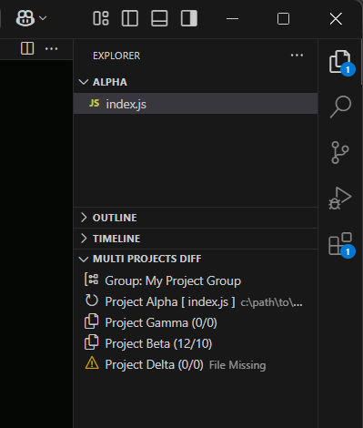

<div align="center">


</div>

<h1 align="center" style="margin: 2rem auto 1rem;">
Multi Projects Diff
</h1>

<h3 align="center" style="margin: 0 auto 1rem;">The project diff tool for VS Code.</h3>

<p align="center">
 <a href="https://marketplace.visualstudio.com/items?itemName=FrancescoAnzalone.multi-projects-diff">
 </a>
</p>

Compare the currently open file in the editor against corresponding files in other project paths (within the same configured group).



## Features

1. **Project Diff View:** A dedicated view in the Explorer sidebar lists all projects within the matched group for the current file, enabling quick comparison.

2. **Clear Diff Indicators:** Project items are clearly labeled with the project name and the number of added/removed lines (`[Project Name] ([Added Lines]/[Removed Lines])`).  A "File Missing" indicator is shown if the file doesn't exist in a particular project.

3. **Features:**
    * **Open Split-Screen Diff:** Click on a project item in the Project Diff View to opens a split-screen diff view comparing the current file with the selected project's file (only available if the file exists).
    * **Copy Content from Main File:** Copies the content of the currently open file to the selected project's file.
    * **Create and Copy File:** Creates the missing file in the selected project and copies the content of the current file. (Only shows if file is missing).
    * **Open File:** Opens the file in the selected project in a new editor tab.
    * **Open Workspace:** Opens the workspace folder of the selected project in a new VS Code window.
    * **Group Selection:** If the current file doesn't belong to any defined group, or if you want to compare against a different group, use the "Pick Group" button to choose a specific group for comparison (only available if the file doesn't belong to any group).

## How to Use

* Open in the editor a file you want to compare.
* Open the "MULTI-PROJECTS-DIFF" view in the Explorer sidebar.
* Click the file name item at the top of the view to refresh the diff.
* Click on a project item to open a split-screen diff view comparing the current file with the selected project's file.

If the file belongs to a configured group, the view will automatically display the diff results against the other projects in that group.

If the file doesn't belong to any group, or if you want to compare against a specific group, use the "Pick Group" button to select a group.

## Configuration

Configure the extension by defining "diff groups" in your VS Code settings (`settings.json`). Each group contains a name, an optional `ignoreWhiteSpace` setting, and an array of "workspaces" (projects).

```jsonc
// Config example
{
  "multiProjectsDiff.diffGroups": [
    {
      "name": "My Project Group",
      "ignoreWhiteSpace": true,
      "workspaces": [
        {
          "name": "Project Alpha",
          "path": "/path/to/project/alpha"
        },
        {
          "name": "Project Beta",
          "path": "/path/to/project/beta"
        },
        {
          "name": "Project Gamma",
          "path": "/path/to/project/gamma"
        },
        {
          "name": "Project Delta",
          "path": "/path/to/project/delta"
        }
      ]
    },
    {
      "name": "Another Group",
      "workspaces": [
        {
          "name": "Project Epsilon",
          "path": "/path/to/project/epsilon"
        }
      ]
    }
  ]
}
```

## Contributing

Contributions are welcome!  Please submit pull requests or bug reports.

## License

This extension is licensed under the MIT License.
